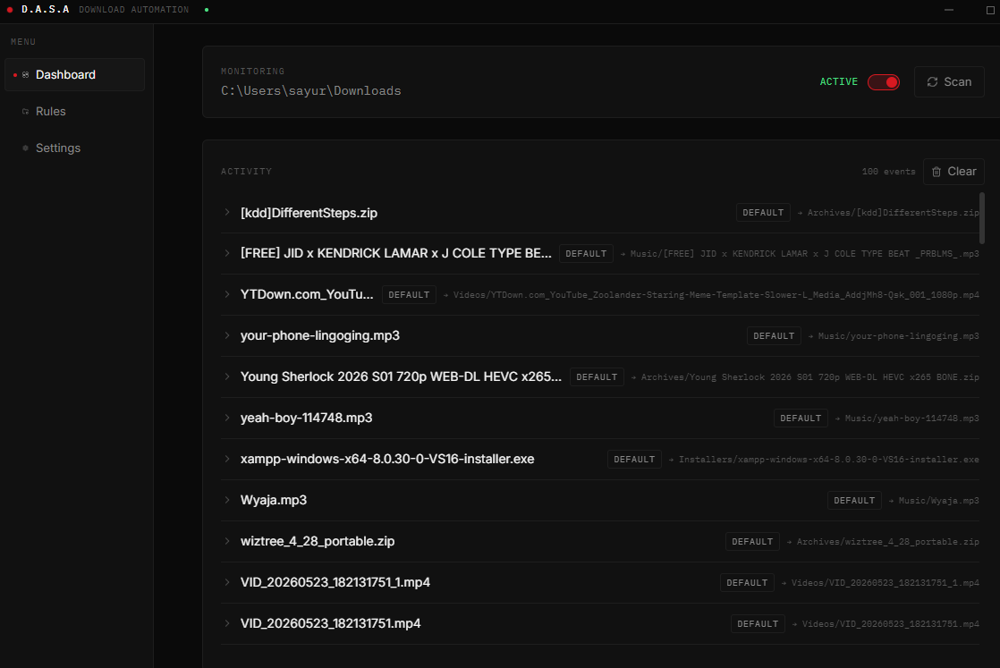
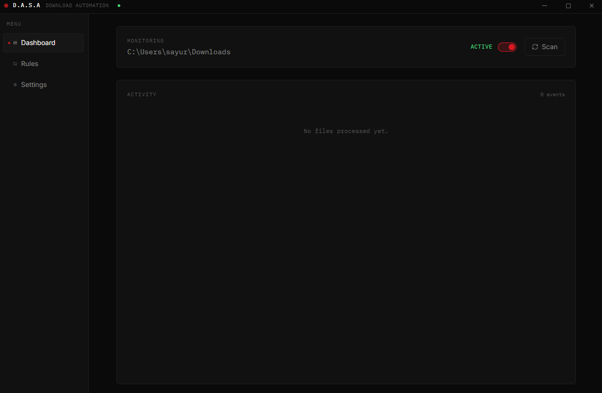
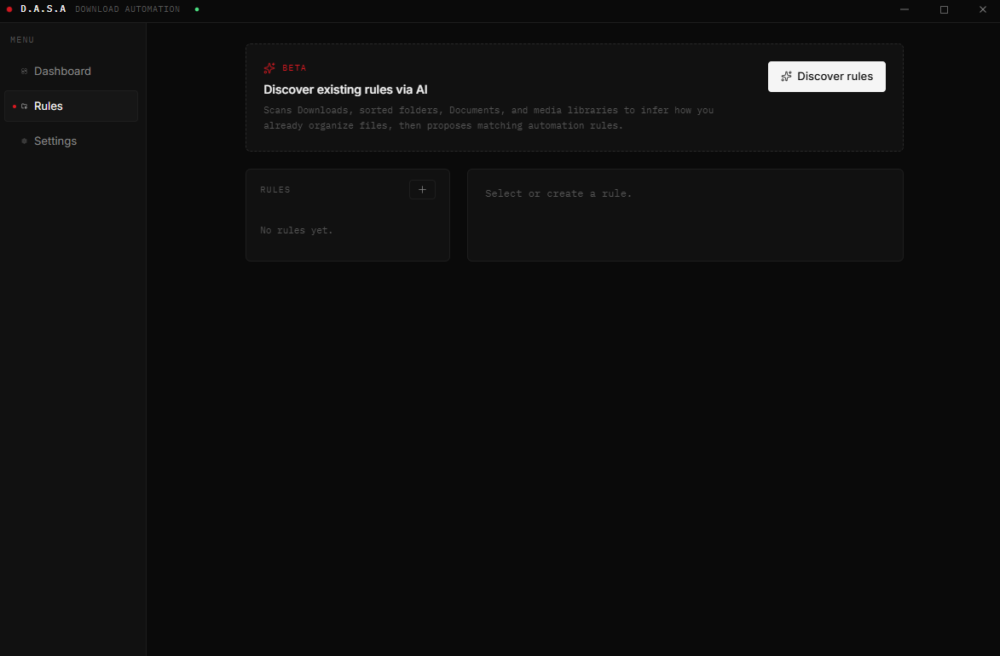
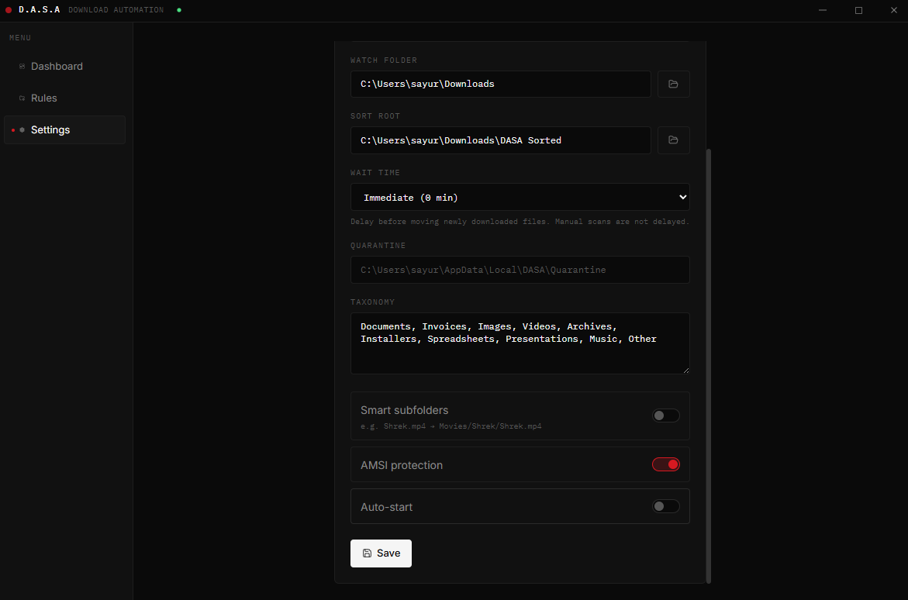

# D.A.S.A

[](LICENSE)

**Download Automation & Security Assistant** — a Windows system-tray app that watches your Downloads folder, scans risky files with **AMSI**, applies your rules, and uses **Google Gemini** for intelligent sorting.

An **open-source passion project**, built for fun. Use it, fork it, break it, improve it — contributions welcome.

**Author:** [Sayuru .J Silva](https://github.com/sayuru-j)  
**GitHub:** [sayuru-j](https://github.com/sayuru-j)  
**Repository:** [sayuru-j/dasa-utility](https://github.com/sayuru-j/dasa-utility)

---

## Features

- **Download monitoring** — watches your Downloads folder and processes files when downloads finish
- **AMSI malware scan** — quarantines suspicious executables/scripts before anything else runs
- **User rules** — priority-based automation with drag-and-drop ordering
- **AI rule discovery (beta)** — scans your existing folders and proposes rules via Gemini
- **Gemini categorization** — semantic sorting with folder consistency and history reuse
- **Smart subfolders** — optional nested paths like `Movies/Shrek/Shrek.mp4`
- **Wait time** — delay moving files so you can finish working with them first
- **Undo moves** — restore files from the activity feed
- **Tray-first UX** — custom title bar, Nothing OS–inspired UI, Framer Motion animations
- **Local-first** — settings, rules, and history stored on your machine; API key encrypted with Windows DPAPI

## Screenshots

### Dashboard — monitoring & activity



### Dashboard — empty state



### Rules — automation & AI discovery



### Settings



## Architecture

```
DASA.sln
└── src/
    ├── DASA.Host/     .NET 10 WPF + WebView2 system-tray host
    └── dasa-ui/       React + TypeScript + Vite + Tailwind + Framer Motion
```

**Processing pipeline (priority order):**

1. AMSI scan → quarantine if malware detected (never sent to Gemini)
2. User rules (`rules.json`)
3. Gemini AI categorization (with folder consistency)
4. Default extension buckets

**IPC:** bidirectional WebView2 `postMessage` between the React UI and the .NET host.

## Requirements

| Component | Version |
|-----------|---------|
| OS | Windows 10/11 x64 |
| [.NET SDK](https://dotnet.microsoft.com/download) | 10.x (to build) |
| [.NET Runtime](https://dotnet.microsoft.com/download) | 10.x (framework-dependent installs) |
| [Node.js](https://nodejs.org/) | 20+ (to build UI) |
| [WebView2 Runtime](https://developer.microsoft.com/microsoft-edge/webview2/) | Evergreen (preinstalled on most Windows 11 PCs) |
| Gemini API key | Optional — required for AI sorting and rule discovery |

## Quick start (development)

### 1. Clone and install

```powershell
git clone https://github.com/sayuru-j/dasa-utility.git
cd dasa-utility
```

### 2. Start the React UI

```powershell
cd src\dasa-ui
npm install
npm run dev
```

Vite serves at `http://localhost:5173`.

### 3. Start the WPF host

In a second terminal:

```powershell
cd src\DASA.Host
dotnet run
```

In **Debug**, the host prefers the Vite dev server (hot reload). Set an explicit URL if needed:

```powershell
$env:DASA_UI_URL = "http://localhost:5173/"
dotnet run
```

### 4. First-time setup in the app

1. Open **Settings** and paste your [Gemini API key](https://aistudio.google.com/) (encrypted via DPAPI).
2. Confirm **Watch folder** (default: `%USERPROFILE%\Downloads`).
3. Set **Sort root** (default: `%USERPROFILE%\Downloads\DASA Sorted`).
4. Enable **AMSI protection**, **Smart subfolders**, or **Wait time** as needed.
5. Save settings.

Closing the window minimizes to the tray. Use **Exit** from the tray menu to quit.

## Production build

```powershell
# From repository root
cd src\dasa-ui
npm ci
npm run build

cd ..\DASA.Host
dotnet publish -c Release -r win-x64 --self-contained false -o .\publish
```

The published folder contains `DASA.exe`, dependencies, `Assets\icon.ico`, and `ui\` (packaged frontend).

For a full production guide — GitHub releases, signing, end-user install, and CI — see **[docs/PRODUCTION.md](docs/PRODUCTION.md)**.

## Local data

All runtime data lives under `%LOCALAPPDATA%\DASA\`:

| Path | Purpose |
|------|---------|
| `settings.json` | App settings (Gemini key encrypted) |
| `rules.json` | Automation rules |
| `history.db` | Activity log + undo tokens |
| `Quarantine\` | AMSI-flagged files |
| `WebView2\` | Embedded browser profile |

**Never commit** API keys, `settings.json`, or `history.db` from your machine.

## Environment variables

| Variable | Purpose |
|----------|---------|
| `DASA_UI_URL` | Force WebView2 to load a specific UI URL (dev or custom) |
| `DASA_GEMINI_MODEL` | Override Gemini model name (default: `gemini-2.5-flash` with fallbacks) |

## IPC reference

| Direction | Message | Purpose |
|-----------|---------|---------|
| UI → Host | `SAVE_RULE` / `DELETE_RULE` / `REORDER_RULES` | Rule CRUD |
| UI → Host | `UPDATE_SETTINGS` | Settings + API key |
| UI → Host | `SET_MONITORING` | Pause/resume watcher |
| UI → Host | `TRIGGER_MANUAL_SCAN` | Scan watch folder now |
| UI → Host | `UNDO_MOVE` | Restore a moved file |
| UI → Host | `CLEAR_ACTIVITY` | Clear activity history |
| UI → Host | `DISCOVER_RULES` / `APPLY_DISCOVERED_RULES` | AI rule discovery |
| UI → Host | `PICK_FOLDER` | Native folder picker |
| UI → Host | `WINDOW_*` | Custom window chrome |
| Host → UI | `FILE_PROCESSED` | New activity item |
| Host → UI | `MALWARE_DETECTED` | Quarantine alert |
| Host → UI | `STATE_SNAPSHOT` | Full app state on load |

## Security notes

- Executables and scripts are AMSI-scanned locally; flagged files are quarantined and **never** uploaded to Gemini.
- The Gemini API key is protected with **Windows DPAPI** (per-user).
- Only file **metadata** (name, extension, size) is sent to Gemini for categorization — not file contents for non-executables in the AI path.

## Troubleshooting

| Issue | Fix |
|-------|-----|
| White screen in the app | Build the UI (`npm run build`) or run Vite dev server in Debug |
| `dotnet build` fails — file locked | Exit DASA from the system tray first |
| Gemini 404 / model error | Set `DASA_GEMINI_MODEL` or update the app; models change over time |
| WebView2 missing | Install [WebView2 Evergreen Runtime](https://developer.microsoft.com/microsoft-edge/webview2/) |

## Contributing

This is a hobby project, but PRs and issues are welcome. If you fix a bug or add a feature:

1. Fork the repo and create a branch.
2. Keep changes focused.
3. Open a pull request with a short description of what changed and why.

Project links:

- GitHub profile: [github.com/sayuru-j](https://github.com/sayuru-j)
- Repository: [github.com/sayuru-j/dasa-utility](https://github.com/sayuru-j/dasa-utility)
- Issues: [github.com/sayuru-j/dasa-utility/issues](https://github.com/sayuru-j/dasa-utility/issues)

No corporate process — just don’t break the build and have fun with it.

## License

Released under the [MIT License](LICENSE).

Copyright © 2026 Sayuru .J Silva

## Documentation

- [Production & GitHub release guide](docs/PRODUCTION.md)
